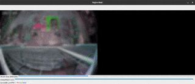
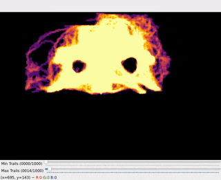
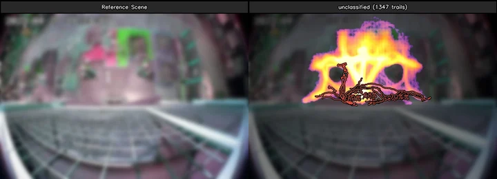
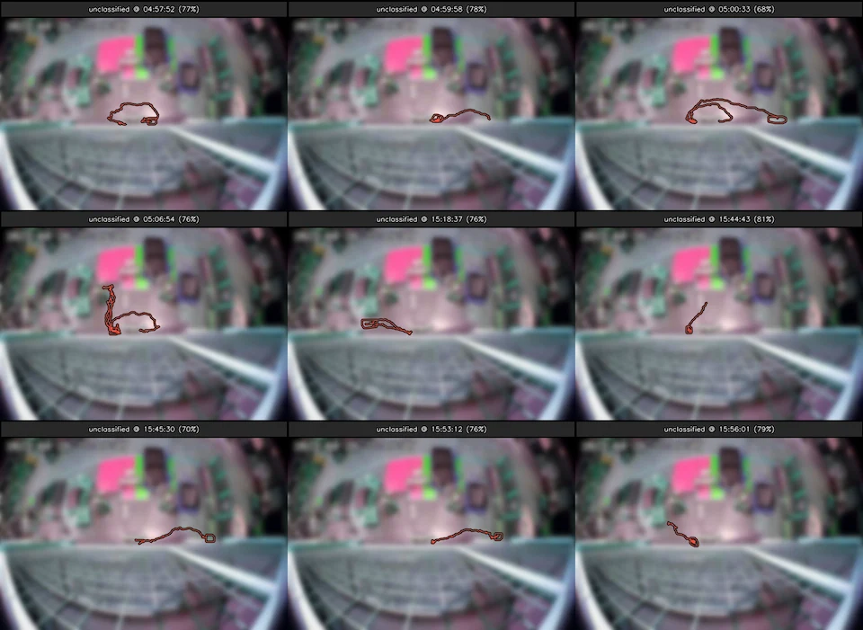
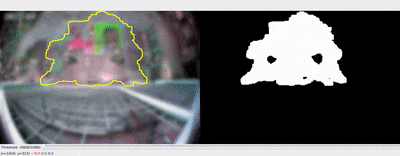

# Anomaly Detection

This is a demo script which tries to find anomaly trails using a heatmap of existing trails. It relies on having trail data from the [safety-cv-2](https://github.com/pacefactory/scv2_realtime) realtime tracking system on the file system. The files are expected to be stored under a `locations` folder and should be structured as follows, where `location_name` and `camera_name` refer to a specific example dataset:

```
locations/
└── location_name
    └── camera_name
        └── report
            ├── images
            │   ├── backgrounds
            │   └── snapshots
            └── metadata
                ├── backgrounds
                ├── camera_info
                ├── config_info
                ├── objects
                └── snapshots

```

## Overview

The anomaly detection works by comparing each trail to a heatmap which represents trail activity in a given scene. The more often a trail spends time in 'hot' (i.e. busy) areas, the less likely it is to be an anomaly.

The heatmaps themselves are generated *graphically*. Starting with a blank image (i.e. all zeros), each trail is drawn (as a polyline) with a certain line thickness, and then is further blurred to smear out the 'influence' of each trail on the heatmap. Each of the resulting blurred trails is combined additively with the heatmap, so that the results 'stack' on top of each other. Additional clamping/scaling is then applied to adjust how much weight busy areas contribute to the overall heatmap versus less busy areas.

The heatmap can be scaled so that the maximum 'heat' at any point is 1.0, while the minimum is 0.0. Since the anomaly values calculate the 'average heat' observed over each trail, it's possible to compute an `anomaly score` by subtracting the average heat from 1:

```
anomaly score = 1.0 - average heat over trail
```

In this format, scores range from 0.0 to 1.0 and trails with high anomaly scores are more likely to be anomalies (i.e. trails that don't match up well with the heatmap). This script calculates the anomaly scores of all objects in the dataset, sorts them, and plots the top few results.


## Install

To run the script, you will first need to install some dependencies.
Start by making & activating a virtual environment:
```
# For linux and mac:
python3 -m venv .env
source .env/bin/activate

# For windows (cmd):
python -m venv .env
.env\Scripts\activate.bat
```

Then install the requirements (from the included `requirements.txt` file):
```
pip install -r requirements.txt
```

## Usage - First run

Run the script using (make sure the virtual environment is activated beforehand):
```
python heatmap_anomalies.py
```

The first time you run the script, you will be asked to enter the path to a [scv2_realtime](https://github.com/pacefactory/scv2_realtime) locations folder:

```
Enter path to scv2 locations folder: ~/enter/path/to/locations
```

This will only occur once, with the result saved in a file called `settings.json` for future use (and you can modify it if you need to change this pathing later on). Other settings are also available in this file for editing.

## Usage


### Step 1: Select location & camera

After entering in a valid locations folder path, you will be asked to select a location & camera from a menu.

```
Select a location:
  1 - localhost
  2 - remote_location
  3 - etc.

Select by index: 1

Select a camera:
  1 - camera_A
  2 - camera_B
  3 - camera_C

Select by index: 2
```

This will determine what data is used to generate the heatmap as well as evaluating anomalies.

### Step 2: Paint region mask

In this step, you can paint a mask which will determine which trails are included when generating the heatmap. More specifically, only trails that spend more than 50% of their time (samples) in the masked region will be counted (this also applies to anomaly detection, trails outside of the mask will not be considered). This can be useful if a particular area of the scene is of interest, but there are lots of irrelevant trails in the surrounding area (which can be left out of the mask).

<p align="center">
  
</p>

An interactive display will appear for you to create a region mask. The image shows the original scene with the mask overlayed on the left, along with the mask on it's own on the right, for comparison.

Masking works by 'painting' either white (in the mask) or black (outside the mask, or erasing), which is controlled by the `Erase/Paint` trackbar on the window. Similarly the paint brush size can be controlled by the `Brush Size` and will be indicated by a green or red circle when hovering the image. If you don't want to exclude any area of the scene, just paint everything white.

### Step 3a: Heatmap scaling

By this point heatmaps will have been created for each class label in the selected dataset (i.e. the selected camera). In this step, you can adjust the scaling of the heatmaps before performing anomaly detection. This will (in general) alter the relative scoring of the trails (i.e. the ordering of which ones are the worst).

<p align="center">
  
</p>

There are controls for setting minimum and maximum thresholds on the number of trails allowed in any given part of the heatmap.

The minimum threshold can be useful to exclude areas with very little traffic from being part of the heatmap. For example, a minimum threshold of 5 means that (roughly) areas with fewer than 5 object trails will be completely excluded from the final heatmap. This prevents rare trails from 'counting towards themselves' later on during scoring.

The maximum threshold can be set to avoid having an overly peaked distribution which may leads to strange weighting behaviors. For example, imagine one section of the scene (say a narrow walkway) sees 5000+ trails, while all other regions only see ~100 trails at most. Without a maximum threshold, any trail that overlaps the 5000+ area may not appear anomalous, simply because of how much 'heat' there is in that area, counting toward the object scoring. The maximum threshold puts an upper limit on how much a given area can count during trail scoring (although there is also a logarithmic scaling applied to reduce these effects further).

### Step 3b: Anomalies per class

After setting the heatmap scaling, anomalies will be plotted. If these look implausible, it may be worth restarting with alternate masking/scaling parameters to achieve better results.

<p align="center">
  
</p>

### Step 3c: Individual anomaly examples

At this point, the top few examples will be shown in a tiled image, along with timesteps and scoring information. Again, these images can be used to decide if the current settings are acceptable.

<p align="center">
  
</p>

### Step 4: Automatic regions by thresholding

Out of curiosity, the last step of this system will attempt to generate regions of interest by applying a threshold to each of the per-class heatmaps. The threshold can be adjusted interactively while observing the resulting region:

<p align="center">
  
</p>

On the left is the original scene with the region contour(s) overlayed, based on the current threshold setting (controlled by the `Threshold` trackbar), while the right image shows the binary thresholded heatmap.


## Issues

- There is limited error handling, if something goes wrong, maybe try different config settings (especially with tiled displays)
- There is only a single region mask which is applied to all classes. It probably makes sense to make these class-specific
- The heatmap log-scaling is completely arbitrary. It may be nice to have other options
- The heatmap trail width (relative to the heatmap size) has a significant impact on the resulting heatmap (and subsequently, anomalies). It would be nice to automate the setting of this value, but it's not obvious how to do so
- Object trails that 'dwell' in a busy area will tend towards being less anomalous even if the rest of the trail exists in rarely seen regions, due to counting the average heat *per sample*. On the otherhand, the heatmaps are generated in a way that does not account for dwelling. This discrepancy may cause issues, especially in scenes with lots of dwelling objects
- When settings *don't* work well, the script forces you to completely start over. This can be a huge pain (especially with region masking), so running the script in an interactive environment is recommended (I used [Spyder](https://www.spyder-ide.org/), but [Jupyter notebook](https://jupyter.org/) or [VS Code with the Jupyter extension](https://marketplace.visualstudio.com/items?itemName=ms-toolsai.jupyter) should work as well).